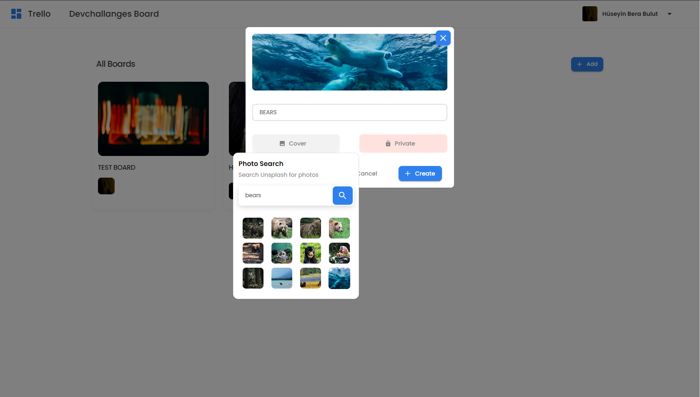
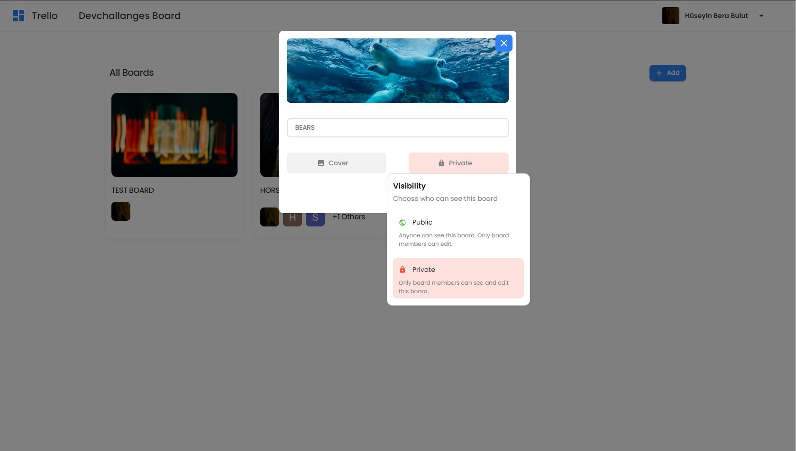

# Project Manager

### Trying to build a trello clone

### It's a [devchallanges.io](https://devchallenges.io/challenges/wP0LbGgEeKhpFHUpPpDh) challenge

 

## Current state of project

 - Authorization (with Firebase auth, I think secure enough?)
	- Sign up with email and password
	- Sign in with Google
	- Sign in with Twitter
	- Sign in with Github

 

 

- Profile page

 

 

- Create new board
	- You can pick a cover image (Unsplash API)
	- Set privacy 

 

 

 

 

- Display boards

 

 