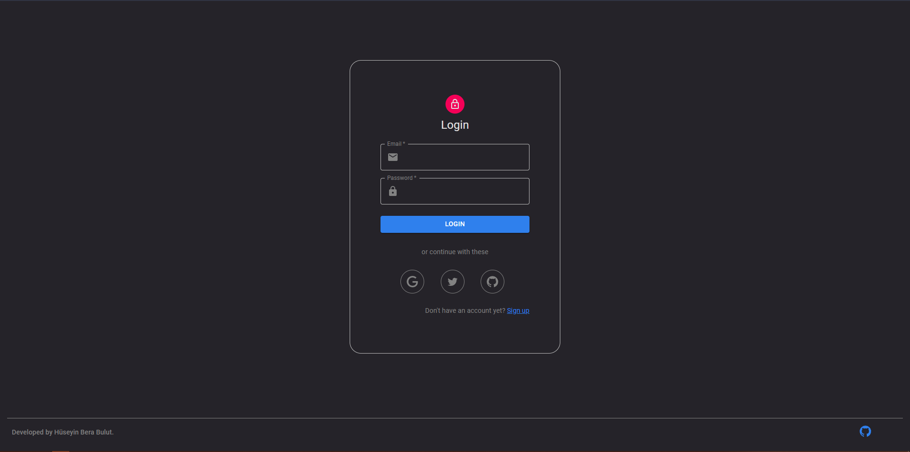
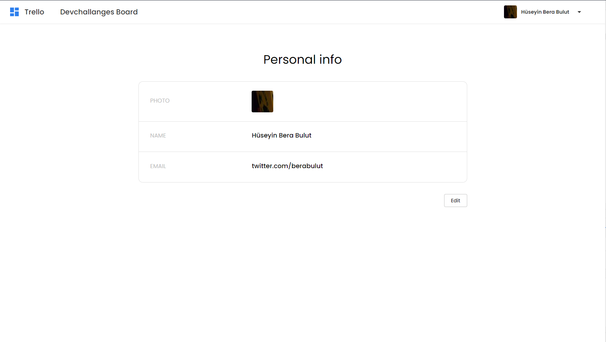
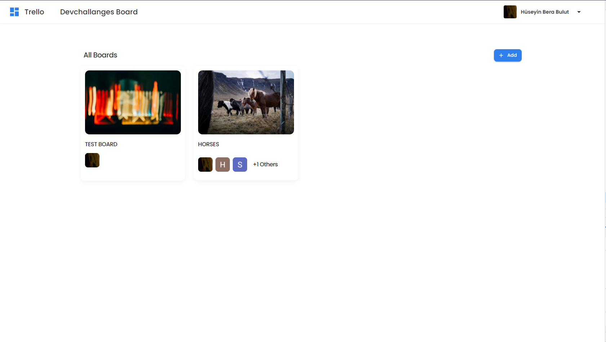

# EXAMPLES

 - Authorization 
	- Sign up with email and password
	- Sign in with Google
	- Sign in with Twitter
	- Sign in with Github

 

 

- Profile page

 

 

- Create new board
	- You can pick a cover image (Unsplash API)
	- Set privacy 

 

 

- Display boards

 

 

- Invite user to board 

 

 

- Create list 

 

 

- Create task 

 

 

- Edit task 

 

 

- Upload attachment (Task's cover image can be picked from them) 

 

 

- You can set cover image from unsplash

 

 

- Set labels

 

 

- Assign members to task

 

 

